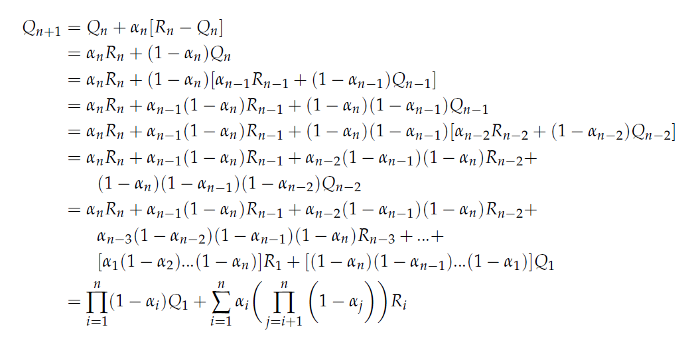

# Exercise 2.4

### If the step-size parameters, αn are not constant, then the estimate Qn is a weighted average of previously received rewards with a weighting different from that given by (2.6). What is the weighting on each prior reward for the general case, analogous to (2.6), in terms of the sequence of step-size parameters?

Let's αn be step size parameter for step n.

