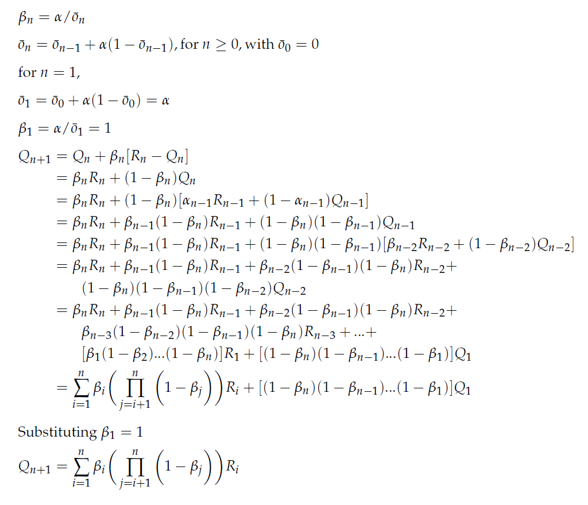

# Exercise 2.7

### *Unbiased Constant-Step-Size Trick* In most of this cchapter we have used sample averages to estimate action values because sample averages do not produce the initial bias that constant step sizes do (see the analusis in (2.6)). However, sample averages are not a completely satisfactory solution because they may perform poorly on nonstationary problems. Is it possible to avoid the bias of constant step sizes while retaining their advantages on nonstationary problems? One way is to use a step size of βn = α/on, to process the nth reward for a particular action, where α > 0 is a conventional constant step size, and on is a trace of one that starts at 0: on = on-1 + α(1 - on-1), for n >= 0, with o0 = 0. Carry out an anaysis like that in 2.6 to show that Qn is an exponential recency-weighted average without initial bias.

Hence, it avoids the initial bias that constant step do.
